# delilog 画面遷移図・フロー図

## 1. 全体画面構成

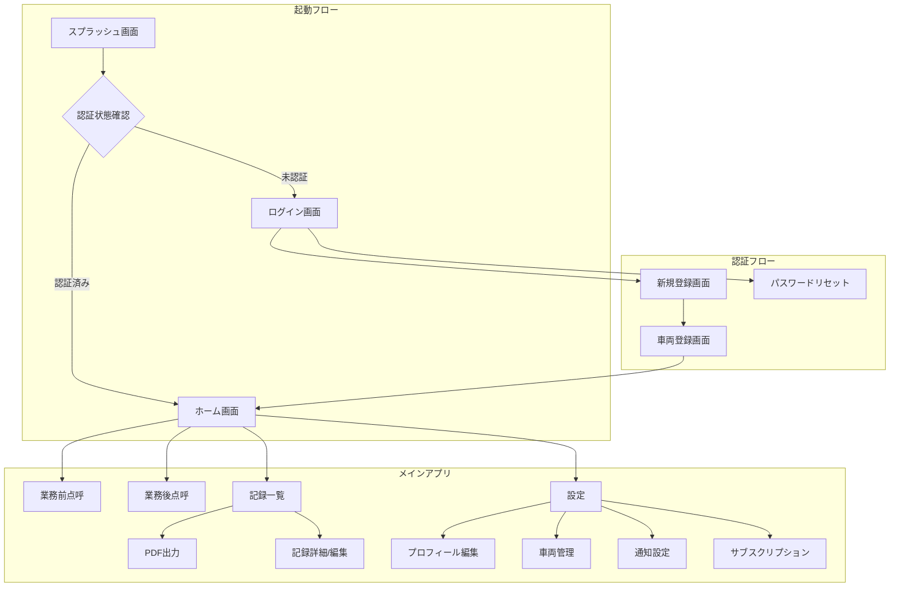

## 2. 認証フロー詳細

### 2.1 ログインフロー

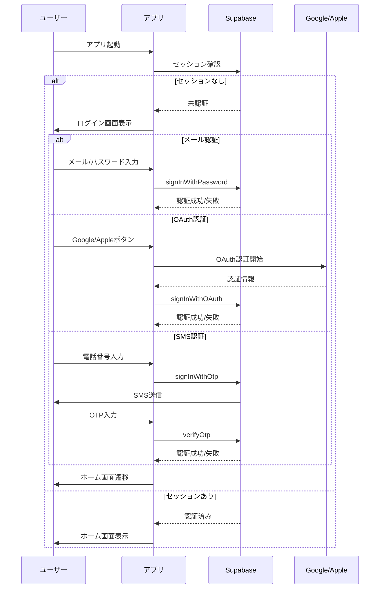

### 2.2 新規登録フロー

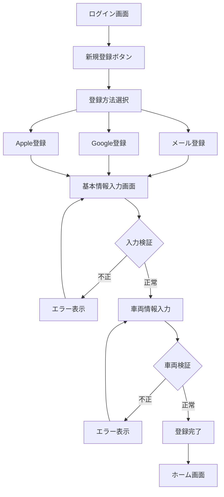

## 3. 点呼記録フロー

### 3.1 業務前点呼フロー

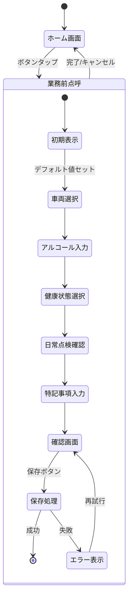

### 3.2 業務後点呼フロー

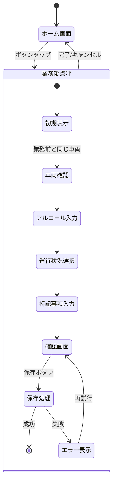

## 4. 記録管理フロー

### 4.1 記録一覧・編集フロー

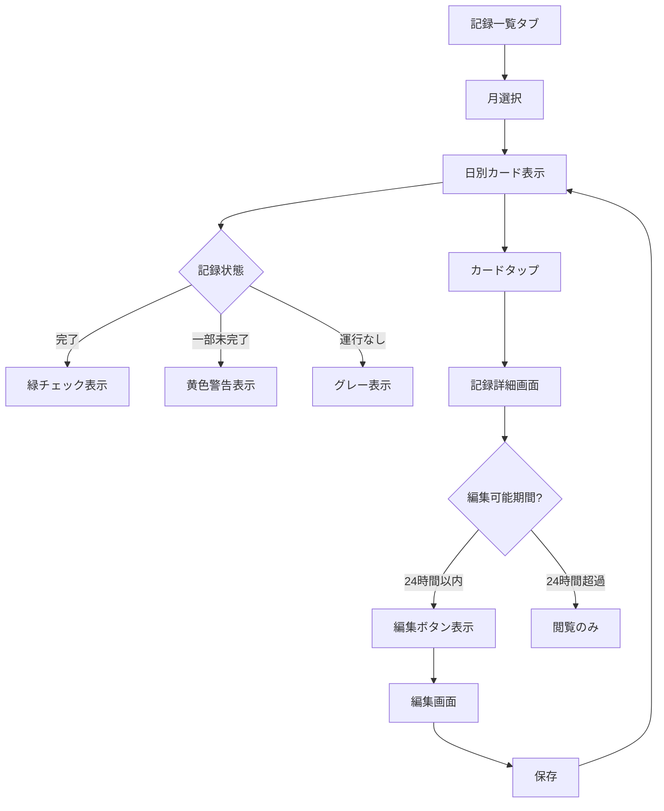

### 4.2 PDF出力フロー

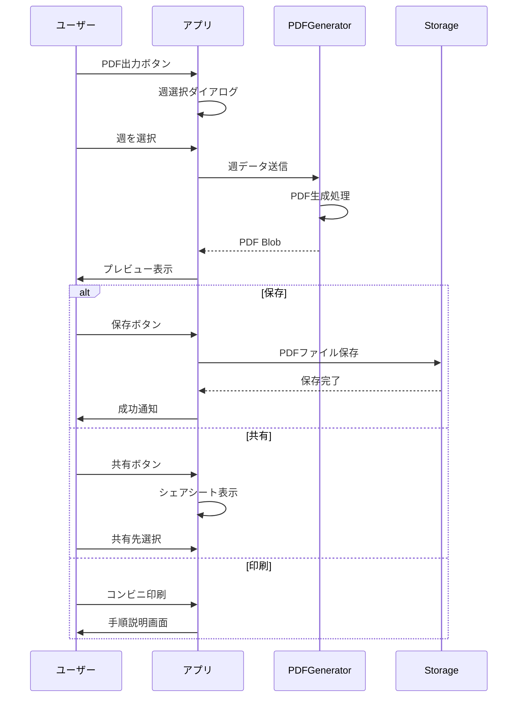

## 5. 設定・管理フロー

### 5.1 車両管理フロー

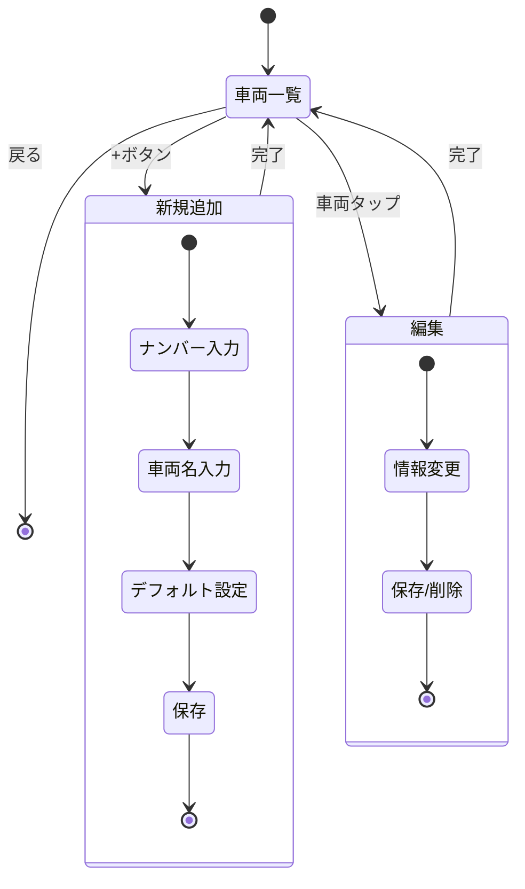

### 5.2 サブスクリプション管理フロー

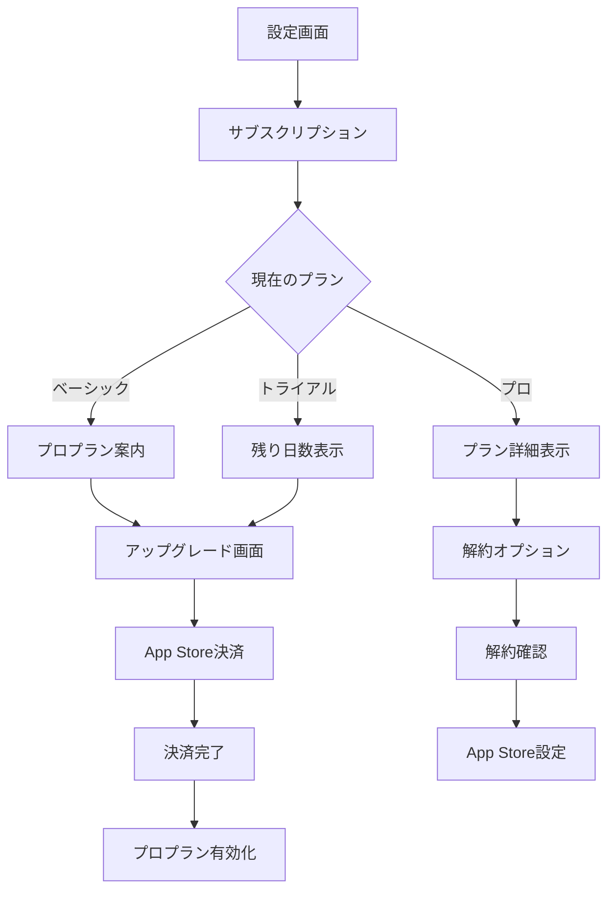

## 6. オフライン時のフロー

### 6.1 オフライン検知と処理

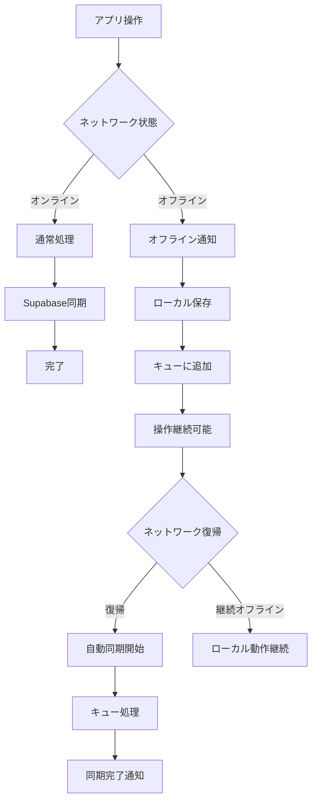

## 7. エラーハンドリングフロー

### 7.1 エラー発生時の処理

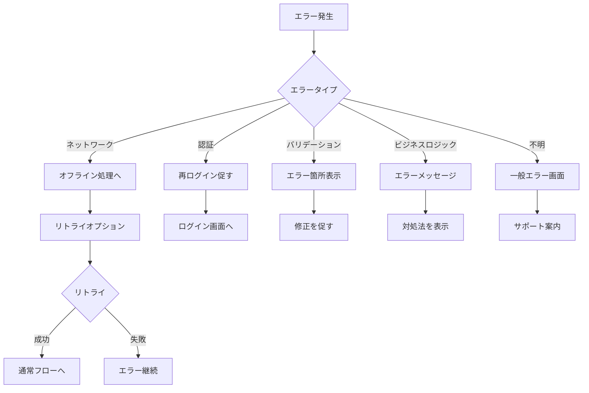

## 8. ナビゲーション構造

### 8.1 タブナビゲーション

```
┌─────────────────────────────────┐
│          Header                 │
├─────────────────────────────────┤
│                                 │
│          Content                │
│                                 │
├─────────────────────────────────┤
│  Home │ Records │ Settings     │
└─────────────────────────────────┘

タブ構成:
- Home: ホーム画面（点呼ボタン、今日の状態）
- Records: 記録一覧（カレンダー表示）
- Settings: 設定（プロフィール、車両、通知等）
```

### 8.2 モーダル・ボトムシート

```
使用箇所:
- 週選択（PDF出力時）: ボトムシート
- 確認ダイアログ: モーダル
- エラー表示: トースト/スナックバー
- 車両選択: ボトムシート
- 日付選択: ネイティブピッカー
```

## 9. 状態遷移のルール

### 9.1 画面遷移の制約

1. **認証必須画面**
   - ホーム画面以降はすべて認証必須
   - 未認証時は自動的にログイン画面へ

2. **戻る操作の制限**
   - 登録完了後はログイン画面に戻れない
   - 点呼記録中は確認ダイアログ表示

3. **重複防止**
   - 同日同種の点呼は作成不可
   - 重複時は既存記録の編集へ誘導

4. **時間制約**
   - 記録の編集は24時間以内のみ
   - 削除も同様の制約

### 9.2 データ整合性の保証

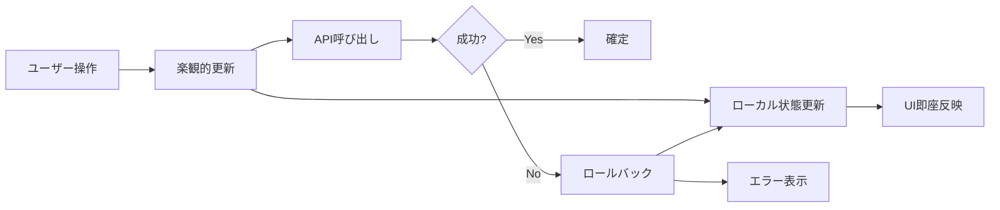
